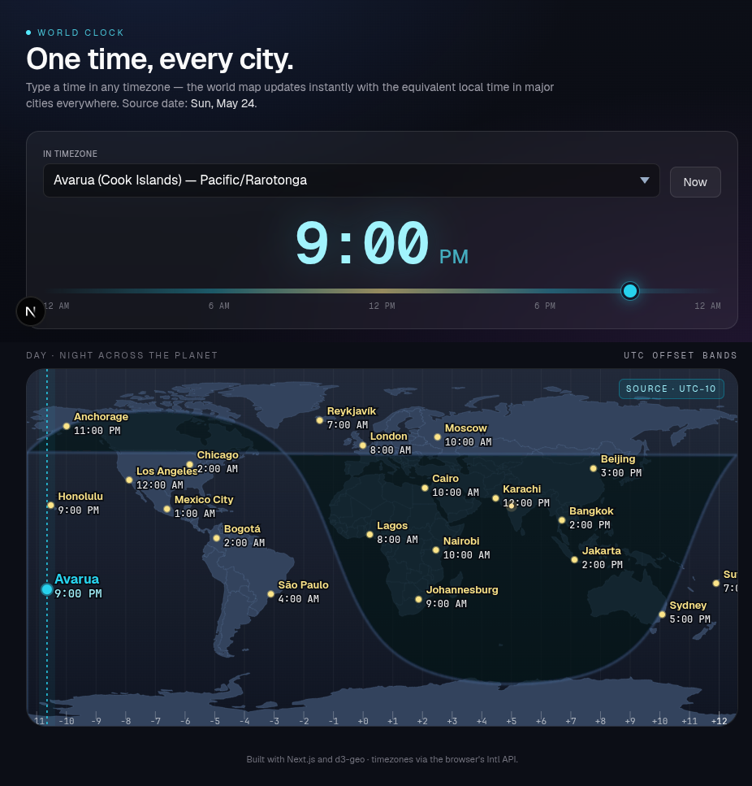

# World Clock

> Scrub a time in any timezone — watch the equivalent local time appear across every major city, on a live day/night world map.

**Live demo:** [tairea.github.io/world-clock](https://tairea.github.io/world-clock/)



## What it does

Pick a city (Avarua, Tokyo, Reykjavík, anywhere) and drag the time slider. Every city label on the map updates instantly, and the day/night terminator drifts with the sun so you can see at a glance whether it's the middle of the night in São Paulo or breakfast in Auckland.

Useful for:

- Scheduling calls across continents without doing arithmetic in your head
- Sanity-checking "what time will it be there when I land?"
- Visualising why "Monday morning" means different things in Tokyo and Honolulu

## Features

- **Real-time time slider** — scrub through any time of day; the map and every city's local time refresh as you drag
- **Source-city picker** — choose which timezone the input applies to (~40 cities, IANA zones)
- **Day/night world map** — true equirectangular projection (d3-geo + world-atlas TopoJSON) with a soft-edged solar terminator computed from declination
- **Smart label culling** — overlapping city labels are dropped automatically, keeping the source city always visible
- **DST-correct** — timezone math goes through the browser's `Intl.DateTimeFormat`, so daylight saving is handled per zone
- **macOS-style UTC offset ribbon** along the bottom, with a highlighted band for the source timezone

## Tech stack

- [Next.js](https://nextjs.org) (App Router, static export)
- [d3-geo](https://github.com/d3/d3-geo) + [world-atlas](https://github.com/topojson/world-atlas) (TopoJSON)
- [Tailwind CSS](https://tailwindcss.com) v4
- TypeScript

No date library — all timezone conversion is done with the built-in `Intl` API.

## Run locally

```bash
npm install
npm run dev
```

Then open <http://localhost:3000>.

## Build & deploy

The site is statically exported and published to GitHub Pages by a workflow in `.github/workflows/deploy.yml` on every push to `main`. Pages URL: <https://tairea.github.io/world-clock/>.

To build the static export yourself:

```bash
npm run build      # writes to ./out
```

## License

MIT
